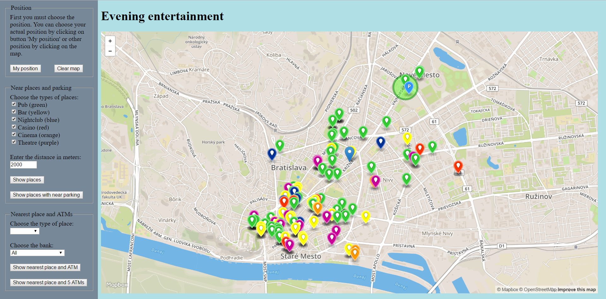

# Prehľad

Táto aplikácia zobrazuje miesta pre večernú zábavu (bary, puby, nočné kluby, herne, kiná, divadlá). Funkcie aplikácie sú nasledovné:
- zobraziť všetky miesta zvolených typov v zadanej vzdialenosti od zvolenej pozície
- zobraziť miesta zvolených typov v zadanej vzdialenosti od zvolenej pozície, v ktorých blízkosti (200 m) je aspoň jedno parkovisko
	- zobraziť parkoviská v okolí 200 m od zvoleného miesta (dvojklikom na toto miesto)
- zobraziť najbližšie miesto zvoleného typu od zvolenej pozície a bankomat, cez ktorý je vzdialenosť od zvolenej pozície po nájdené najbližšie miesto najkratšia
	- môže byť vybratý bankomat konkrétnej banky a tým sa budú brať do úvahy len takéto bankomaty
- zobraziť najbližšie miesto zvoleného typu od zvolenej pozície a 5 najbližších bankomatov od tohto miesta

Takto to vyzerá v akcii:



Aplikácia pozostáva z dvoch častí. Prvá je [frontend](#frontend) (klientská časť), ktorý používa mapbox API a mapbox.js. Druhá je [backend](#backend), ktorý je naprogramovaný v Jave a komunikuje s databázou PostGIS prostredníctvom JDBC konektora. Komunikácia medzi týmito dvomi časťami je zabezpečená pomocou [REST API](#api).

# Frontend

Frontend je HTML stránka (`index.html`), ktorá používa mapbox.js pre zobrazenie mapy v štýle Street. Okrem mapy zobrazuje aj bočný panel, v ktorom si používateľ volí typy miest, bankomatov či vzdialenosť a stlačením tlačidla získa potrebný výsledok. Zdrojový kód pre frontend je v súbore `index.html`, v ktorom sa využíva JavaScript pre zabezpečenie funkcionality a jQuery pre volania REST API. Na získanie aktuálnej polohy sa využíva [geolocation](https://developer.mozilla.org/en-US/docs/Web/API/Geolocation/Using_geolocation).

# Backend

Backend je naprogramovaný v jazyku Java a zabezpečuje pripojenie k databáze, vykonanie dopytov a vrátenie GeoJSON výstupu pre frontend. Pre beh aplikácie sa využíva Apache Tomcat a 3 JAR súbory:
- `java-json.jar`
- `javax.ws.rs-api-2.0.jar`
- `postgresql-9.2-1002.jdbc4.jar`

## Data

Použité dáta sú z Open Street Maps, pričom bolo stiahnuté celé Slovensko a pomocou nástroja `osm2pgsql` boli údaje importované do databázy v PostgreSQL rozšírenej o PostGIS. GeoJSON je generovaný pomocou funkcie `ST_AsGeoJSON`.

## Api

**Nájsť všetky miesta zvolených typov v zadanej vzdialenosti**

`GET /main/query/getByDistance/{x}/{y}/{d}/{a}`

**Nájsť miesta zvolených typov v zadanej vzdialenosti, v ktorých blízkosti je parkovisko**

`GET /main/query/getByDistanceWithPark/{x}/{y}/{d}/{a}`

**Nájsť parkoviská v okolí 200 m od konkrétneho miesta**

`GET /main/query/getPark/{x}/{y}`

**Nájsť najbližšie miesto zvoleného typu a bankomat, cez ktorý je vzdialenosť k danému miestu najkratšia**

`GET /main/query/getNearestAndATM/{x}/{y}/{a}`

**Nájsť najbližšie miesto zvoleného typu a bankomat konkrétnej banky, cez ktorý je vzdialenosť k danému miestu najkratšia**

`GET /main/query/getNearestAndATMType/{x}/{y}/{a}/{b}`

**Nájsť najbližšie miesto zvoleného typu a 5 najbližších bankomatov od tohto miesta**

`GET /main/query/getNearestAndATM5/{x}/{y}/{a}`


### Response

API vracia GeoJSON obsahujúci 2 kľúče, a to `geometry` and `properties`. `properties` zahŕňa meno, typ, symbol, farbu a veľkosť konkrétneho bodu. Príklad:
```
{"geometry":{"coordinates":[17.1369199,48.1540125],"type":"Point"},"type":"Feature","properties":{"marker-symbol":"marker","amenity":"theatre","name":"Elledanse","marker-color":"#cc0099","marker-size":"medium"}}
```